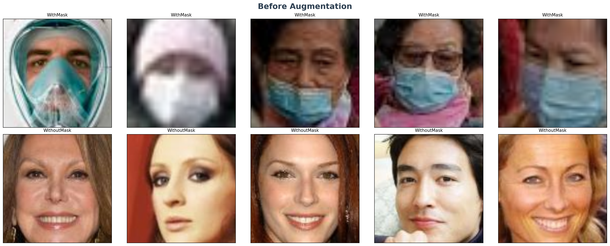
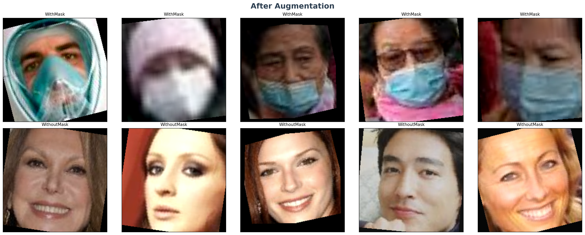

# Face Mask Detection — AML Project

   

> A deep learning system that detects whether a person is wearing a face mask or not, built with MobileNetV2 transfer learning and deployed via FastAPI + Docker.

---

## Team

| # | Role | Member |
|---|------|--------|
| 1 | Data Manager | Jumana |
| 2 | EDA & Visualizer | Adam |
| 3 | Augmentation Designer | Ahmed |
| 4 | Model Trainer | Ghada |
| 5 | Evaluator | Doha |
| 6 | API Developer | Gehad & Fatma |
| 7 | Deployer & Presenter | Fatma & Gehad |

---

## Dataset

- **Source:** [Face Mask 12K Images Dataset — Kaggle](https://www.kaggle.com/datasets/ashishjangra27/face-mask-12k-images-dataset)
- **Classes:** `WithMask` / `WithoutMask`
- **Total Images:** ~12,000 real-world face photos
- **Split:** Train / Validation / Test (pre-organized)

| Split | WithMask | WithoutMask | Total |
|-------|----------|-------------|-------|
| Train | 4,982 | 4,983 | 9,965 |
| Validation | 398 | 400 | 798 |
| Test | 482 | 506 | 988 |

---

## Project Structure

```
face-mask-AML_project/
│
├── data/                        # Dataset folder (not uploaded to GitHub)
│   ├── Train/
│   │   ├── WithMask/
│   │   └── WithoutMask/
│   ├── Validation/
│   └── Test/
│
├── notebooks/
│   ├── eda_notebook.ipynb       # EDA + 8 visualizations (Adam)
│   └── evaluation.ipynb        # Confusion matrix + metrics (Doha)
│
├── src/
│   ├── data_loader.py           # PyTorch DataLoader setup (Jumana)
│   ├── verify_dataset.py        # Check for corrupt images (Jumana)
│   ├── augmentation.py          # Augmentation pipeline (Ahmed)
│   └── train.py                 # Training script — MobileNetV2 (Ghada)
│
├── model/
│   └── mask_detector.pth        # Trained model weights (Ghada)
│
├── api/
│   ├── app.py                   # FastAPI app — /predict endpoint (Gehad)
│   └── test_api.py              # Automated API tests (Gehad)
│
├── docker/
│   ├── Dockerfile               # API container (Fatima)
│   ├── Dockerfile.streamlit     # Streamlit UI container (Fatima)
│   └── docker-compose.yml       # Full stack deployment (Fatima)
│
├── ui/
│   └── app.py                   # Streamlit UI (Fatima)
│
├── reports/
│   ├── dataset_report.md        # Class balance + data stats (Jumana)
│   ├── metrics_report.md        # F1, Precision, Recall, Accuracy (Doha)
│   └── training_curves.png      # Loss/Accuracy plots (Ghada)
│
├── presentation/
│   └── demo_slides.pdf          # 10-minute presentation (Fatima)
│
├── .gitignore
└── README.md
```

---

## Model

- **Architecture:** MobileNetV2 (Transfer Learning — pretrained on ImageNet)
- **Framework:** PyTorch + TorchVision
- **Export Format:** `.pth`
- **Model File Size:** ~13.6 MB
- **Input Size:** 224 × 224 × 3

### Classifier Head

```
Linear(1280 → 256) → ReLU → Dropout(0.2) → Linear(256 → 2)
```

### Parameters

| | Count |
|--|--|
| Total parameters | 2,552,322 |
| Trainable (Phase 1) | 328,450 (12.9%) |
| Trainable (Phase 2) | 1,534,530 (60.1%) |

### Training Configuration

| Hyperparameter | Value |
|----------------|-------|
| Batch Size | 32 |
| Max Epochs | 20 (Phase 1: 10 + Phase 2: 20) |
| Actual Epochs Run | 23 (Early Stopping) |
| Learning Rate — Phase 1 | 1e-3 |
| Learning Rate — Phase 2 | 1e-4 |
| Optimizer | Adam |
| Loss Function | CrossEntropyLoss |
| Early Stopping Patience | 4 |
| Device | CUDA (GPU T4 — Google Colab) |

### Training Strategy

Training was split into two phases:

- **Phase 1 — Head Training:** Base MobileNetV2 layers frozen. Only the custom classifier head is trained for 10 epochs.
- **Phase 2 — Fine-tuning:** Top layers unfrozen. Full model fine-tuned with a lower learning rate for up to 20 epochs (stopped early at epoch 13).

### Evaluation Results

| Metric | Value |
|--------|-------|
| Accuracy | **99.90%** ✅ |
| Precision | 0.9990 |
| Recall | 0.9990 |
| F1-Score | 0.9990 |
| ROC-AUC | 1.0000 |

> Target accuracy was > 90% — **achieved with a significant margin.**

---

# Data Augmentation Strategy
### Face Mask Detection — Role 3: Augmentation Designer

---

## The Problem: Real-World Data Challenges

Rather than relying on generic augmentation techniques, we designed a **data-driven augmentation pipeline** based on insights obtained from the Exploratory Data Analysis (EDA).

Our dataset (~11,751 images) contains several real-world imperfections:

| Issue | Count | Percentage |
|-------|-------|------------|
| Blurry images | 2,350 | ~20% |
| Overexposed images | 117 | ~1% |
| Dark images | 48 | ~0.4% |
| Corrupted images | 0 | 0% |
| Class balance | 50/50 | Balanced |

> Training the MobileNetV2 model on clean data alone would lead to **overfitting**, making it unreliable in real-world scenarios such as low-quality surveillance cameras or poor lighting conditions.

---

## The Solution: Justification for Each Augmentation

Each augmentation was carefully selected to simulate a specific real-world condition while **preserving essential features** (face and mask):

> **Note on Hyperparameters:**
> The augmentation parameters listed below (rotation degrees, probability values, jitter ranges)
> are **initial baseline values**.
> Final values will be fine-tuned in collaboration with **Role 4 — Model Trainer**
> based on validation accuracy and training curves.

### 1. `Resize (224x224)`
- **Why:** Standard input size required for MobileNetV2, ensuring compatibility with pretrained weights.

### 2. `RandomHorizontalFlip (p=0.5)`
- **Why:** Human faces are generally symmetrical. This simulates people looking in different directions.
- **Note:** Vertical flipping was deliberately avoided as it produces unrealistic upside-down face samples.

### 3. `RandomRotation (15)`
- **Why:** Simulates natural head tilt while keeping the face orientation realistic.
- **Why 15 not 30:** Larger rotations distort facial features and produce unrealistic samples.

### 4. `ColorJitter (brightness=0.2, contrast=0.2, saturation=0.2)`
- **Why:** Directly addresses the **48 dark images** and **117 overexposed images** found in EDA.
- Simulates indoor/outdoor lighting variations common in surveillance scenarios.

### 5. `RandomApply([GaussianBlur], p=0.1)`
- **Why:** Simulates motion blur and low-resolution cameras.
- **Why p=0.1 (low probability):** ~20% of the dataset is already blurry — a higher probability would overwhelm the model with too many blurry samples.

### 6. `RandomPerspective (distortion_scale=0.2, p=0.2)`
- **Why:** Simulates different camera angles such as tilted or overhead surveillance cameras.
- **Why p=0.2 (low probability):** Combined with rotation, higher values would cause over-distortion.

### 7. `Normalize (mean=[0.485, 0.456, 0.406], std=[0.229, 0.224, 0.225])`
- **Why:** MobileNetV2 was pretrained on ImageNet — these are the exact
  mean and std values computed from the ImageNet dataset.
- Normalizing with the same values ensures the model receives input
  in the same distribution it was trained on.
- **Applied on both train and val/test** — this is not augmentation,
  it is a required preprocessing step.
- Skipping this step would cause the pretrained weights to behave
  unpredictably and degrade accuracy significantly.

---

## Implementation

```python
import torchvision.transforms as transforms

# Training Pipeline — WITH Augmentation
train_transform = transforms.Compose([
    transforms.Resize((224, 224)),
    transforms.RandomHorizontalFlip(p=0.5),
    transforms.RandomRotation(15),
    transforms.ColorJitter(brightness=0.2, contrast=0.2, saturation=0.2),
    transforms.RandomApply([
        transforms.GaussianBlur(kernel_size=3, sigma=(0.1, 2.0))
    ], p=0.1),
    transforms.RandomPerspective(distortion_scale=0.2, p=0.2),
    transforms.ToTensor(),
    transforms.Normalize([0.485, 0.456, 0.406],
                         [0.229, 0.224, 0.225])
])

# Validation & Test Pipeline — WITHOUT Augmentation
test_val_transform = transforms.Compose([
    transforms.Resize((224, 224)),
    transforms.ToTensor(),
    transforms.Normalize([0.485, 0.456, 0.406],
                         [0.229, 0.224, 0.225])
])
```

> **Why no augmentation on Validation/Test?**
> We evaluate the model on clean, unmodified images to get a true measure of real-world performance.

---

## Visual Results

### Before Augmentation


### After Augmentation


> The augmented images show realistic variations in **rotation**, **perspective**, **brightness**, and **blur** — exactly the conditions the model will encounter in real-world deployment.

---

## Key Insight

All augmentations are applied **on-the-fly during training**, meaning the model sees a slightly different version of each image in every epoch.

```
Epoch 1 -> Original image
Epoch 2 -> Same image + slight rotation
Epoch 3 -> Same image + horizontal flip + color change
...
```

This significantly **improves generalization** and **reduces overfitting** without requiring additional data collection.

---

## Summary

| Challenge | Augmentation Applied |
|-----------|---------------------|
| Blur (~20% of data) | `GaussianBlur (p=0.1)` |
| Dark images | `ColorJitter (brightness=0.2)` |
| Overexposed images | `ColorJitter (contrast=0.2)` |
| Camera angle variation | `RandomPerspective (p=0.2)` |
| Face orientation | `RandomHorizontalFlip (p=0.5)` |
| Head tilt | `RandomRotation (15)` |

This augmentation strategy enhances the model's robustness to real-world challenges while preserving the critical features needed for **accurate face mask detection**.

---

## API

```bash
# Run locally
uvicorn api.app:app --reload --port 8000

# Swagger docs
http://localhost:8000/docs
```

**Example response:**
```json
{
  "status": "mask_on",
  "action": "Allow entry",
  "confidence": 0.96
}
```

---

## Docker

```bash
# Build and run both services
docker compose -f docker/docker-compose.yml up --build

# Test the API
python api/test_api.py
```

### Docker Containers (2 Microservices)

| Container | Port | Service |
|-----------|------|---------|
| `api` | 8000 | FastAPI — inference & prediction |
| `streamlit` | 8501 | Streamlit — web UI |


---

## Test Results

### Single Image Test


### Gang Test 


---

## Tech Stack

| Tool | Purpose |
|------|---------|
| PyTorch + TorchVision | Model training & transfer learning |
| FastAPI + Uvicorn | REST API deployment |
| Streamlit | Interactive web UI |
| Docker | Containerized deployment |
| Pillow | Image preprocessing |
| scikit-learn | Metrics & evaluation |

---

## Timeline

| Week | Milestone | Members |
|------|-----------|---------|
| 1 | Dataset setup, EDA, Augmentation pipeline | Jumana, Adam, Ahmed |
| 2 | Model training, evaluation, export .pth | Ghada, Doha |
| 3 | FastAPI app, Docker, test script | Gehad, Fatma |
| 4 | Integration test, presentation, live demo | All |

---

## Installation

```bash
pip install torch torchvision fastapi uvicorn python-multipart Pillow scikit-learn streamlit
```

---

## How to Contribute

1. Clone the repo
2. Create your branch: `git checkout -b feature/your-name`
3. Commit your work: `git commit -m "add: your task description"`
4. Push: `git push origin feature/your-name`
5. Open a Pull Request to `main`
